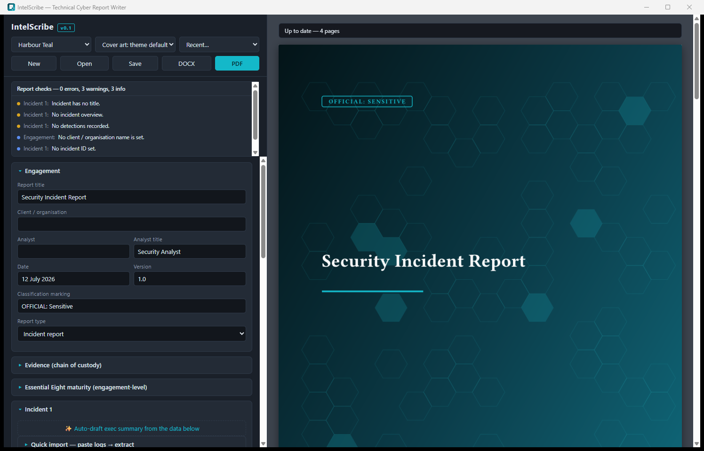
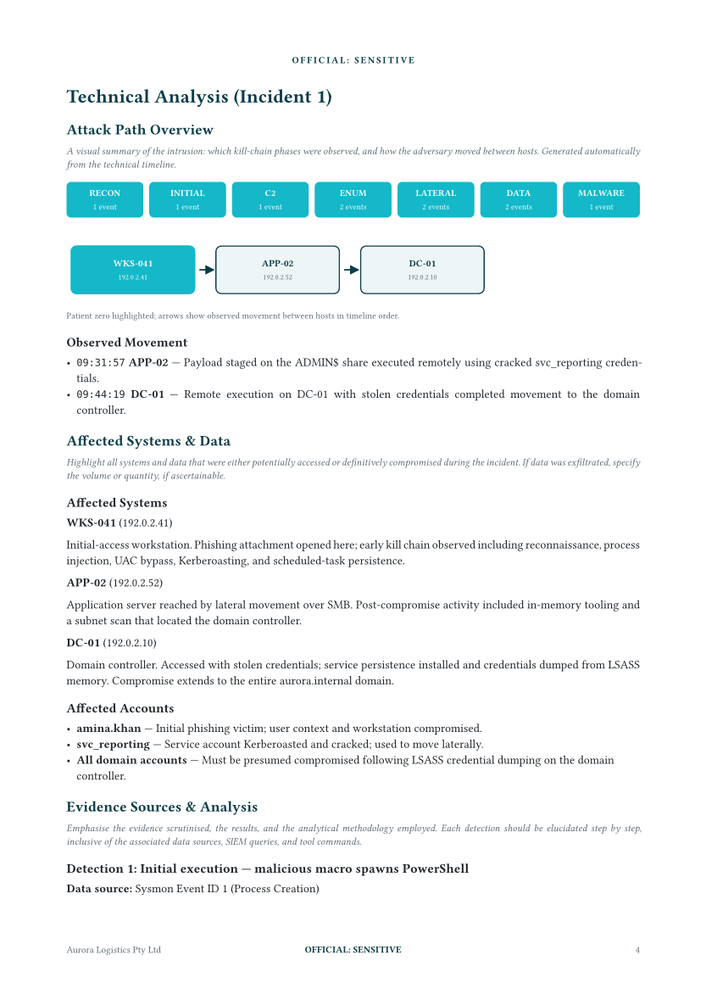
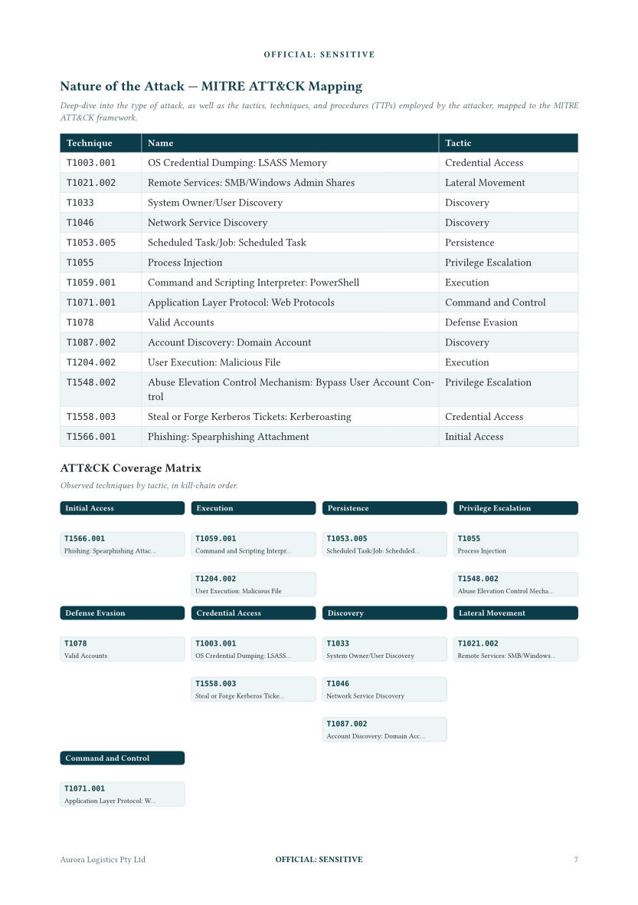
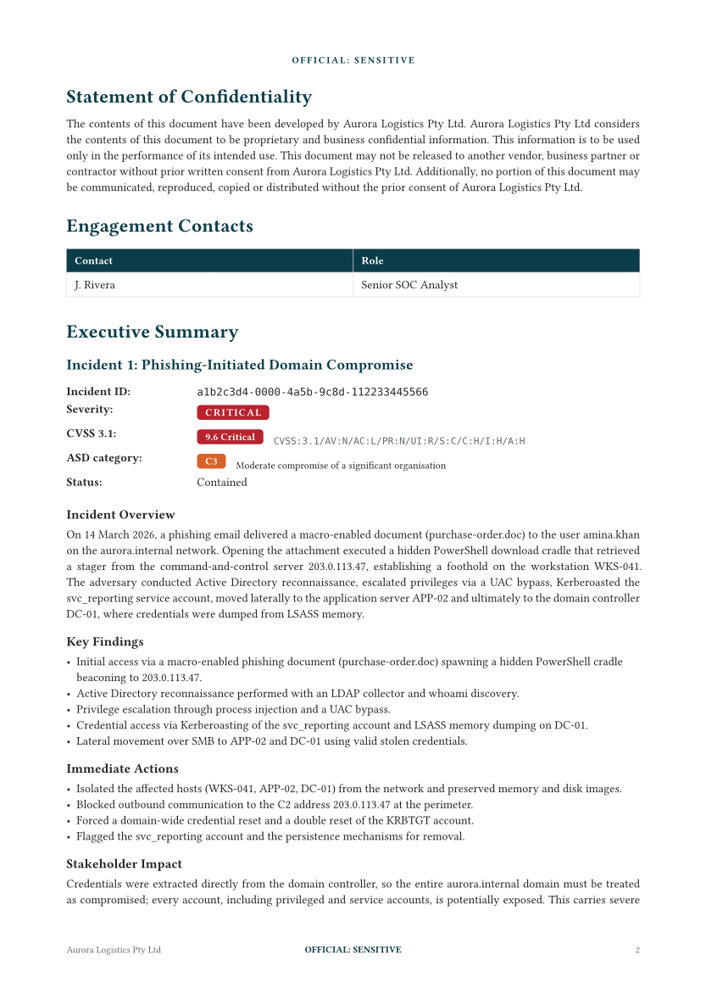
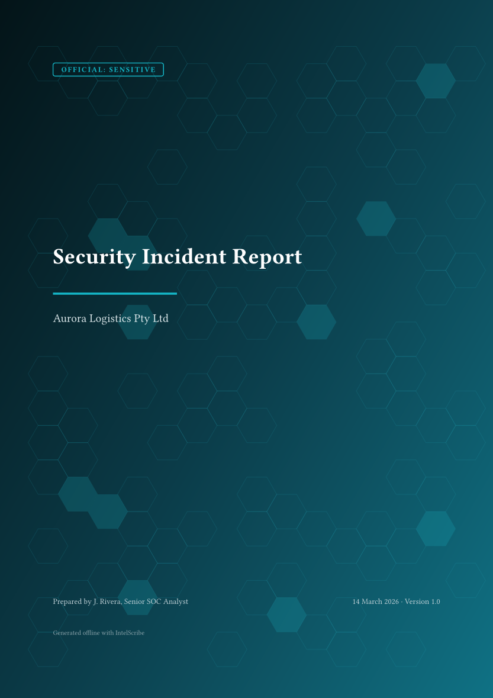
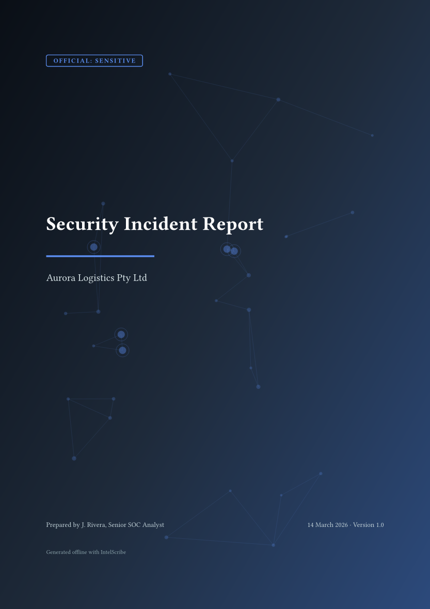
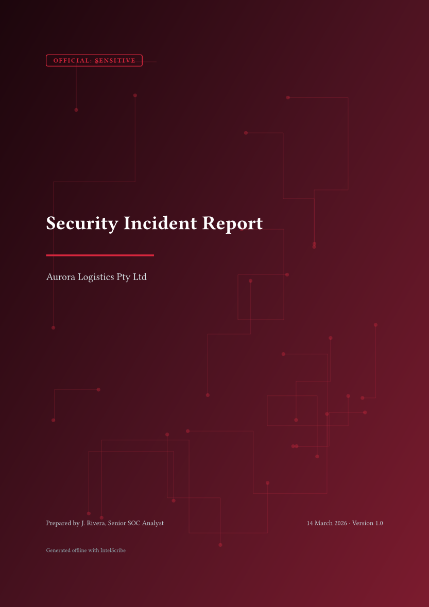
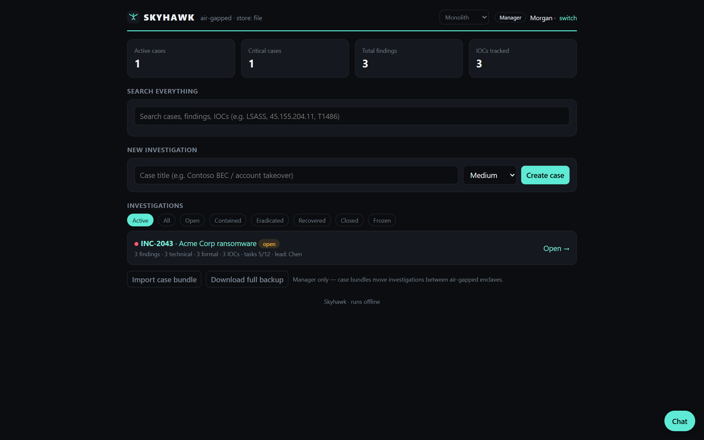
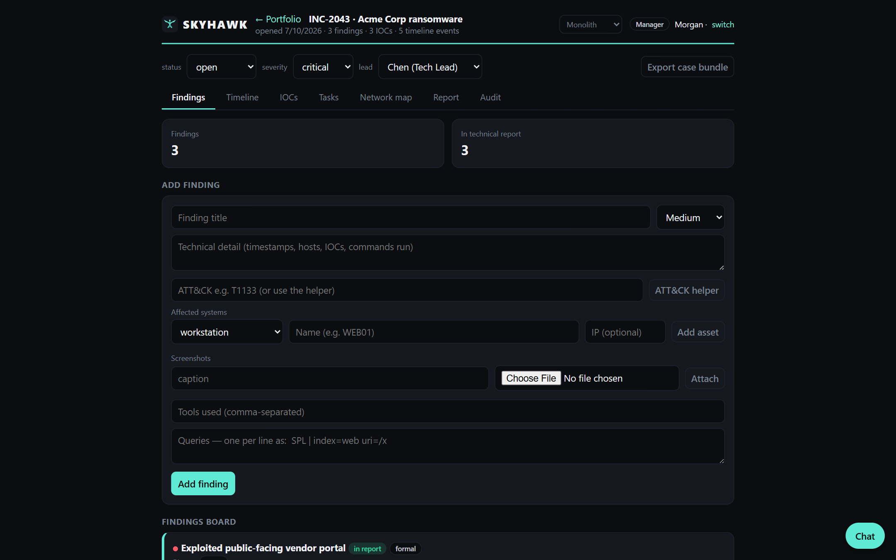
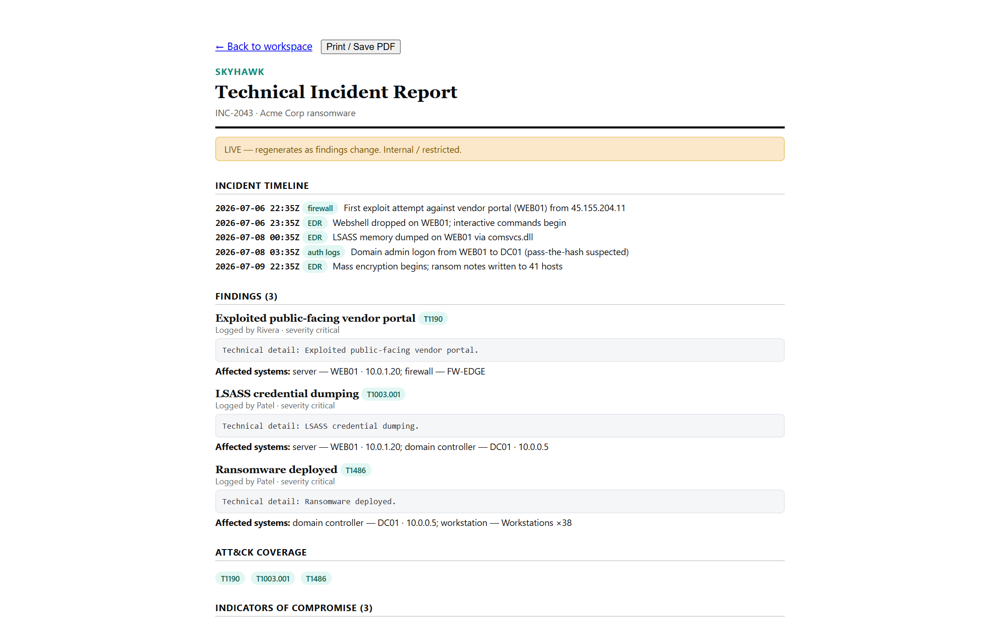

*offline-first, deterministic, and built for air-gapped environments.*

---

## About

- 🛡️ Defensive security analyst — SOC monitoring, detection engineering, incident response and reporting
- 🇦🇺 Deep focus on Australian frameworks: **ACSC ISM**, **Essential Eight**, ASD incident categorisation, SOCI & NDB reporting obligations
- 🔧 Daily drivers: **Splunk · Elastic · Sysmon · Volatility · KAPE**
- 🦀 I build compiled, dependency-light tooling in **Rust** and **zero-dependency Node.js** — everything runs fully offline

---

## 📝 IntelScribe

**Offline desktop app that turns structured incident facts into commercial-grade cyber reports.**
Rust · Tauri · Typst — [`xGhst0/intelscribe`](https://github.com/xGhst0/intelscribe) · Apache-2.0

Enter each fact once (hosts, detections, IoCs, timeline, techniques) — IntelScribe generates the executive
summary, numbered detections with SIEM queries, IoC tables, an auto-drawn attack-path map, a kill-chain
timeline, MITRE ATT&CK coverage matrix, auto-derived mitigations, verbatim ACSC ISM control quoting and
CVSS 3.1 scoring, rendered to themed PDF or DOCX. The full **MITRE ATT&CK matrix (697 techniques)** and the
**Australian Government ISM** ship inside the binary — no internet connection at any point.

The desktop app: structured form, live report linter, and instant themed PDF preview.

| Auto-drawn attack path | ATT&CK coverage matrix | Executive summary |
|:---:|:---:|:---:|
|  |  |  |

**18 palettes × 6 procedural cover-art generators — 108 distinct looks, all generated, no stock imagery:**

| Harbour Teal · hexgrid | Midnight Slate · network | Crimson Vector · circuit |
|:---:|:---:|:---:|
|  |  |  |

Also in the box: a live report **linter** (completeness, consistency and sanitisation checks), document
import (`.pdf` / `.docx` / `.doc` / `.txt` → IoCs, hosts, timeline, detections and suggested techniques
extracted automatically), an **evidence vault** with SHA-256 chain-of-custody register, a CVSS 3.1
builder, and a penetration-test report type with a likelihood × consequence risk matrix.

---

## 🦅 SKYHAWK

**Air-gapped investigation-to-report platform for blue-team analyst teams.**
Zero-dependency Node.js · [`xGhst0/skyhawk`](https://github.com/xGhst0/skyhawk) · MIT

Analysts capture findings with full evidence, leads curate, managers sign — and every case produces a
live technical report and a frozen, signed formal report. Runs entirely on `localhost` / your LAN:
no internet, no database, no npm packages. Role-based access (Analyst / Tech Lead / Manager) with
scrypt-hashed credentials, server-side sessions and login rate-limiting. A one-command bundler packs
SKYHAWK plus the Node runtime into a checksum-verified tarball for machines that have never seen the internet.

Case portfolio: live stats, global search across cases, findings and IoCs.

| Case workspace | Live technical report |
|:---:|:---:|
|  |  |

---

## Toolbox

**Detection & DFIR**&nbsp;&nbsp;

**Engineering**&nbsp;&nbsp;

**Frameworks**&nbsp;&nbsp;

---

📫 **benjamin.sokimi@gmail.com**

